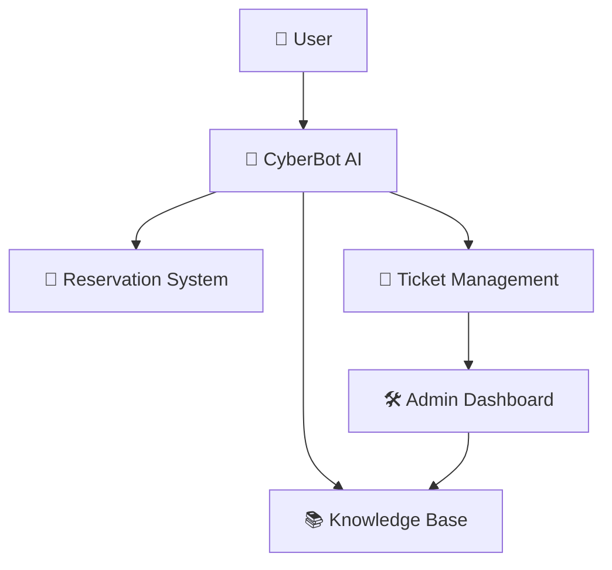

<!-- ========================================================= -->
<!-- 🚀 CYBERBOT PRO AI -->
<!-- ========================================================= -->

<div align="center">


# 🍽️ CyberBot Pro AI
### ⚡ AI-Powered Restaurant Support & Smart Customer Assistance Platform

<p align="center">


</p>

<p align="center">


</p>

<br>

<a href="https://restaurant-support-chatbot.vercel.app/">
  
</a>

</div>

---

# 🌟 Project Overview

**CyberBot Pro AI** is an advanced AI-powered restaurant support chatbot designed to streamline customer interactions, automate support operations, and improve restaurant service management through intelligent conversational AI.

The system handles:

✅ Booking Queries  
✅ Order Status Tracking  
✅ Complaint Registration  
✅ Support Escalation  
✅ FAQ Retrieval  
✅ User History Lookup  
✅ AI-Assisted Customer Support  

Built with a modern full-stack architecture, the platform combines **GenAI capabilities**, **real-time chat workflows**, and a **premium futuristic UI experience**.

---

# 🎯 Project Objectives

The primary goal of this project is to create a smart restaurant support ecosystem capable of:

- Enhancing customer experience
- Automating repetitive support tasks
- Managing restaurant support workflows efficiently
- Providing intelligent FAQ retrieval
- Reducing manual support overhead
- Delivering fast and accurate assistance

---

# 🖼️ Application Preview

# ✨ Main Chat Interface

<p align="center">

</p>

<p align="center">
💎 Futuristic Glassmorphism • AI Chat Experience • Real-Time Interaction
</p>

---

# 👤 User Support Panel

<p align="center">

</p>

<p align="center">
🍽️ Smart Booking • Complaint Support • Order Tracking
</p>

---

# 🛠️ Admin Dashboard

<p align="center">

</p>

<p align="center">
📊 Ticket Management • AI Monitoring • Analytics Dashboard
</p>

---

# ⚡ Core Features

# 🧠 AI-Powered Conversational Assistant

CyberBot intelligently understands and processes customer queries using AI-powered intent classification.

### Supported Intents
- 🍕 Food Ordering
- 📅 Table Reservation
- 📦 Order Status
- 🎫 Complaint Registration
- ❓ FAQ Assistance
- 🛎 Customer Support

---

# 📚 FAQ Retrieval System (RAG-Based)

The chatbot retrieves answers dynamically from a restaurant knowledge base using a Retrieval-Augmented Generation inspired workflow.

### Features
✅ Smart document retrieval  
✅ Context-aware responses  
✅ Persistent FAQ storage  
✅ Real-time answer generation  

---

# 🎫 Complaint & Escalation Management

### Automatic Ticket Creation
Customer complaints automatically generate support tickets for admin handling.

### Escalation Workflow
Critical issues are escalated instantly to ensure faster support resolution.

### Resolution Tracking
Admins can monitor:
- Ticket status
- User complaints
- Resolution progress
- Customer feedback

---

# 📅 Smart Reservation Management

### Real-Time Booking Validation
Prevents duplicate table bookings and scheduling conflicts.

### Intelligent Booking Flow
Users can:
- Reserve tables
- Modify reservations
- Track booking status

---

# 📖 User History Lookup

The chatbot maintains interaction history to provide:
- Personalized support
- Faster issue resolution
- Better customer experience

---

# 📊 Admin Analytics Dashboard

Interactive dashboards provide insights into:

📈 Booking activity  
📊 Ticket statistics  
🤖 Chatbot performance  
🎯 User interaction trends  

Built using:
- Plotly
- Recharts

---

# 🔐 Security Features

### 🛡️ Access Protection
The platform includes basic security guardrails against:
- Unauthorized commands
- Invalid admin access
- Suspicious interactions

### ⚠️ Safe Configuration
Sensitive data and credentials are excluded from public exposure.

---

# 🎨 UI/UX Highlights

✨ Modern Glassmorphism Design  
✨ Smooth Framer Motion Animations  
✨ Responsive Layout  
✨ Interactive Dashboard Components  
✨ Futuristic Anime-Inspired Interface  
✨ Real-Time Chat Experience  

---

# 🏗️ System Architecture



---

# 🛠️ Technology Stack

| Technology | Purpose |
|------------|----------|
| ⚛ React + Vite | Frontend Development |
| ⚡ FastAPI | Backend API |
| 🧠 LangChain | AI Workflow |
| 📚 ChromaDB / FAISS | Vector Database |
| 🎨 Tailwind CSS | UI Styling |
| 🎞 Framer Motion | Animations |
| 📊 Plotly / Recharts | Data Visualization |
| ☁️ Vercel | Deployment |

---

# 📂 Project Structure

```bash
CyberBot-Pro-AI/
│
├── backend/
│   ├── api/
│   ├── routes/
│   ├── models/
│   ├── services/
│   └── database/
│
├── frontend/
│   ├── components/
│   ├── pages/
│   ├── dashboard/
│   ├── chatbot/
│   └── styles/
│
├── public/
├── package.json
├── requirements.txt
└── README.md
```

---

# ⚙️ Installation & Setup

# 1️⃣ Clone Repository

```bash
git clone https://github.com/your-username/restaurant-support-chatbot.git
```

---

# 2️⃣ Navigate to Project Folder

```bash
cd restaurant-support-chatbot
```

---

# 3️⃣ Install Frontend Dependencies

```bash
npm install
```

---

# 4️⃣ Install Backend Dependencies

```bash
pip install -r requirements.txt
```

---

# 5️⃣ Run Frontend

```bash
npm run dev
```

---

# 6️⃣ Run Backend Server

```bash
uvicorn main:app --reload
```

---

# 🚀 Deployment

This project can be deployed using:

- ▲ Vercel
- Render
- Netlify
- Railway
- Firebase Hosting

---

# 🧪 Testing & Validation

The project includes testing for:

✅ Chat functionality  
✅ FAQ retrieval accuracy  
✅ Ticket generation  
✅ Booking validation  
✅ Edge case handling  
✅ Admin workflows  

---

# 📌 Future Enhancements

- 🤖 OpenAI API Integration
- 🌍 Multi-language Support
- 📱 Mobile App Version
- 🎙 Voice Assistant
- 🧾 AI Billing Assistant
- 📡 Real-Time Database Integration
- 🍔 Smart Food Recommendation Engine
- 🧠 Advanced NLP Models

---

# 📄 License

This project is licensed under the **MIT License**.

```txt
MIT License © 2026
```

---

# ⭐ Support

If you found this project useful:

⭐ Star the repository  
🍴 Fork the project  
📢 Share with others  
💡 Contribute improvements  

---

<div align="center">

# 💙 THANK YOU FOR VISITING

### ⚡ CyberBot Pro AI — Smart Restaurant Support Powered by AI


</div>
